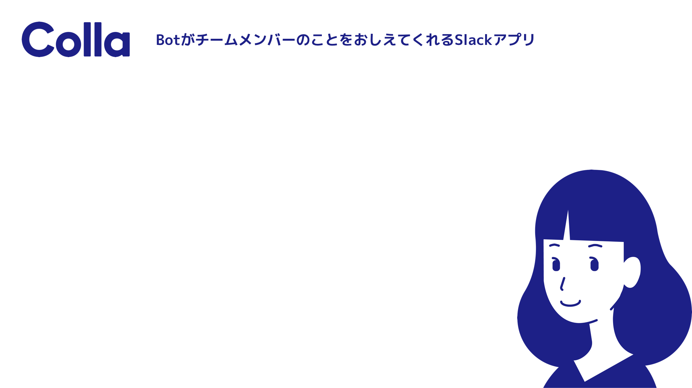
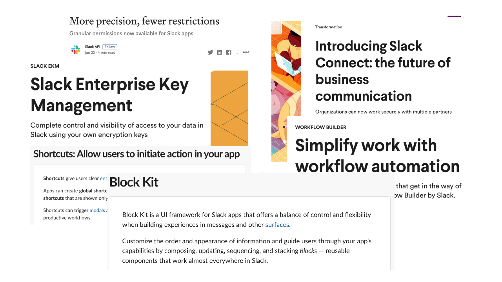
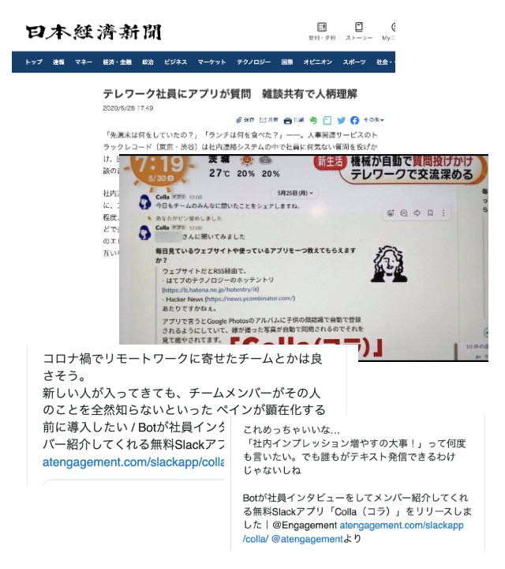

# **コロナ時代を生き抜く(?) Slack アプリ開発・運用 知見まとめ**

---

# 自己紹介

::::: grid1-2
:::: grid-item center circle-image

::: classes small
 [@munky69rock](https://twitter.com/munky69rock)
:::
::::
:::: grid-item
**上原 将之**
株式会社トラックレコード CTO

::: classes small
前職は DeNA で小説投稿サイトの[エブリスタ](https://estar.jp/)とか遺伝子検査の[MYCODE](https://mycode.jp/)とか[AI 創薬プロジェクト](https://healthcare.dena.com/projects/services/aidrugdiscovery/)などなどやってました
:::
::::
:::::

---

**[株式会社トラックレコード](https://www.trackrecords.co.jp/)って？**

以下のようなサービスを開発・運営してます

**エンジニアキャリア支援サービス**

- 「[kiitok（キイトク）](https://www.kiitok.com/)」
  - ネクストキャリアを考えている人は是非ご相談を、エンジニアの採用市況はかなり詳しいです:muscle: \[PR]

**チームのエンゲージメントを向上させる Slack アプリの開発**

- 仲間をスタンプでホメて、表彰する「[ホメルくん](https://homerukun.slackapp.studio/)」
- 仲間をコメントで褒めて表彰する「[ノビルくん](https://nobirukun.slackapp.studio/)」
- :new: Bot が社員インタビューをしてメンバー紹介してくれる「[Colla（コラ）](https://atengagement.com/slackapp/colla/)」
  * **→ 今日はこの Colla の開発・運用周りの話をメインにします:muscle:**

---

# ...なんですが

これだけ見ると Slack アプリそこそこ詳しそう感ありますが

- 最初の 2 アプリは諸事情によりリリース後あまり追加開発・メンテできておらず...
- その間(1~2 年弱)に Slack 側でめっちゃいろいろアップデートされてる...

---

::: classes center
🤔
:::

---

::: classes center
🤯
:::

---

::: classes center
ほどよい期待値でお楽しみください:innocent:
(ツッコミおまちしてます)
:::

---

# Agenda

1. これまでリリースしたアプリの紹介
2. Slack アプリ開発の現状
3. 実際にあったハマりポイント

::: classes small ml-1 text-gray
細かい開発の話などはしません:no_good:
([Bolt のドキュメント](https://slack.dev/bolt-js/ja-jp/tutorial/getting-started)が非常に参考になります)
:::

---

# これまでリリースしたアプリの紹介

---

# 過去の Slack アプリの紹介

::::: grid2-1
:::: grid-item

## ホメルくん

::: classes small

- Slack のリアクションでホメて、 チームの動きをもっと簡単にみんなで共有できるアプリ
- 登録した絵文字のリアクションに反応して、メッセージを特定のチャンネルにリポスト
- 毎月、もっとも多くホメられた人を表彰 :tada:

:::

::: classes small text-gray

- 古くて参考にならないかもですがこのあたりの話は以下の記事に :eyes:
  - [初めて Slack app をつくって審査通すところまでやった知見を晒す - Qiita](https://qiita.com/munky69rock/items/3342c7b7c642fd2c68f3)

:::

::::
:::: grid-item center

::::
:::::

---

# 過去の Slack アプリの紹介

::::: grid2-1
:::: grid-item

## ノビルくん

::: classes small

- 褒めことばを贈りあうことで、チームを強くするアプリ
- 設定したチャンネルでメンション付きでメッセージを送るとノビルくんが相づち
- 毎月、褒めことばをもらった人と贈った人を表彰 :tada:

:::
::::
:::: grid-item center

::::
:::::

---

# 今回新たにリリースした Slack アプリ

## Colla（コラ）

::::: grid2-1
:::: grid-item
::: classes small

Bot が社員インタビューをしてメンバー紹介してくれる無料 Slack アプリ

**課題**

- コロナ禍でリモート前提の働き方にシフト
- チャットベースだとコミュニケーション減りがち (雑談など)
- 新メンバーのオンボーディングもなかなか対面で顔を合わせることができない...

**Colla（コラ）が解決してくれること**

- コラさんが勝手にメンバーに質問、毎日回答を発表
  - 雑談のきっかけ、あまり関わらなくなったメンバーのことが知れる
- 新メンバーが Slack に join したタイミングで質問、回答するとみんなに紹介してくれる
  - リモートでのオンボーディングをよりスムーズに

:::
::::
:::: grid-item center

::::
:::::

---

# Colla（コラ） 誕生ストーリー

- コロナの猛威、緊急事態宣言、ステイホーム、、、
- ピンチはチャンス、今のタイミングで会社としてできるとは？
- タイミング的に緊急事態宣言終了する前に新しいチャレンジを世に出したい！
- GW 一週間くらいでガッと企画・開発 → リリース :rocket:

---

- リリース直後に日経新聞・めざまし土曜日などで取り上げられる
- 現在多くの WS でインストール、問い合わせも多数
- Twitter などでも好意的なコメント:pray:

#### <!-- fit --> [参考: 新型コロナ:テレワーク社員にアプリが質問 雑談共有で人柄理解 :日本経済新聞](https://www.nikkei.com/article/DGXMZO59689850Y0A520C2L83000/)

---

# ...なんですが

- リリースや運用通していろいろとハマりポイントが...
- 実運用周りの話はなかなか検索しても出てこないツラみ

---

# Slack アプリ開発の現状

---

# Slack が多機能化・複雑化してきた

- Permissions
- Block Kit
- Surfaces
- Shortcuts, etc...

出来ることは増えたが、一方で開発コストも:up:

- ツールやライブラリも充実してきてはいるがある程度慣れは必要

::: classes small
参考: [2020 年の Slack App 開発者が知るべき最新の Slack API 仕様 | PLAID engineer blog](https://tech.plaid.co.jp/slack_api_spec_trend_2020/)
:::

---

# プロダクトとしての Slack アプリの難しさ

**安定性**

- さまざまなケースに対応して安定した機能提供が求められる
  - 多様なユーザーステータス(シングルチャンネルゲストなど)や共有チャンネルでの動作 etc...
  - Enterprise Grid 対応 (後述)

**アプリの審査**

- Slack App Directory に登録するためには Slack の審査が必須
  - ≒ iOS や Android アプリ開発
  - 審査に一定時間がかかるなど、自社でコントロールできない要素
- 権限のアップデートを含む更新をしたいときに意図しない挙動をすることも (後述)

---

**セキュリティ**

- 情報管理体制など、企業からの問い合わせも多い
  - 社内コミュニケーションツールとしてセンシティブな情報にアクセスできてしまう可能性
  - 扱う情報によっては ISMS や P マークなどとの取得も要検討
    - ホメルくん、ノビルくんでは極力データの取得や保存しないように

---

# Enterprise Grid

- 大企業向けに複数の WS を組織でまとめられるもの
- プロダクトとしてちゃんとマネタイズしようと思うと対応不可避
- 単に WS まとめられる以上に様々な機能

::: classes small ml-1
参考:

- [What is Slack Enterprise Grid? | Slack](https://slack.com/help/articles/360004150931-What-is-Slack-Enterprise-Grid)
- [リクルートが「乱立 Slack」の社内統一へ、「Enterprise Grid」に移行中【週刊 Slack 情報局】 - INTERNET Watch](https://internet.watch.impress.co.jp/docs/column/slack_info/1267758.html)
  :::

---

# Enterprise Grid の主なハードル

1. Enterprise Grid 特有の挙動
2. Enterprise Grid の動作検証

---

# Enterprise Grid 特有の挙動

**例**

- EG 内の WS 間でアカウント共通化 (WS A と WS B で同じユーザーとして扱われる)
- その結果 DM が WS またいで共通化、通知は最後にいた WS に飛んでくる
  - これだけだとふーん、という感じだが、Slack アプリで DM 使ってる場合ややこしい問題が (後述)
- 共有チャンネルに、外部 WS との共有(`is_ext_shared`)に加えて組織内での WS との共有という内部ステータスが追加(`is_org_shared`)
  - 組織外 WS と組織内 WS を同時に共有することはできない模様

---

- 権限周りや EG 内の複数の WS にいる場合の挙動など、普段 EG 使ってない人からすると結構想定外の挙動することが多い
  - 少なくともドキュメントはざっくり眺めておいたほうが良い([Building apps in Enterprise Grid | Slack](https://api.slack.com/enterprise/grid))
- Enterprise Grid を見越した設計が必要
  - そのプロダクトが Enterprise Grid 環境下でどう機能すべきか？
  - ホメルくんで設計考慮できておらず一部インストールできない問題もあった

---

# Enterprise Grid の動作検証

- 申請することで Sandbox 環境の取得が可能
  - https://api.slack.com/enterprise/grid/testing
  - 大体申請して 1~2 日くらいでもらえた
- 2 つの Enterprise Grid 環境を付与される、共有チャンネルの動作検証も可能
- Enterprise Grid を利用している企業も、Enterprise Grid の管理権限がない場合、申請したほうが無難
- 昔は一部付与に条件あった気がしたが、現状は比較的気軽に付与してもらえそう？ 🤔

---

# 実際にあったハマリポイント

---

# Sign in with Slack 問題

---

[Sign in with Slack](https://api.slack.com/docs/sign-in-with-slack)とは？

- Slack が提供する OAuth 認証
- 一定プロダクトとして機能追加していきたい場合、Web 側の対応も不可欠
- Slack アプリとの親和性も高く、初期の認証機能としてはリーズナブル

---

# 起きている問題 (現在進行系)

1) OAuth の Redirect URL はアプリの管理画面から登録する必要あり (登録されているもの以外はエラー)
1) Sign in with Slack 用にアプリのインストールとは別のエンドポイント追加したい
1) リリース後に変更を加える場合、Development copy というものが作成され、本番とは別に設定が管理されている
1) レビューのために動作確認したいが、どうやら挙動としては本番アプリのものを参照しまっている模様 (おそらくバグ？)
1) 動作確認できずレビューにもだせず
1) 詰む :innocent:

---

- 現在問い合わせ中、権限追加して申請するようにとのことで申請 & 承認待ち (今週水曜の話)
- 上記シューティングしている中で、申請前のアプリだと Permission に `identity.basic` がなくても動作していたが、どうやらリリース後のアプリではその権限がないとエラーになることも判明
- また、上記とは直接関係ないが、Sign in with Slack のオプションとして WS の ID を渡すことでログインできる WS を限定できるはずだが、こちらもバグでエラーになってしまう模様
  - 参考: [oauth_authorization_url_mismatch on oauth.v2.access when url includes team parameter · Issue #1017 · slackapi/node-slack-sdk](https://github.com/slackapi/node-slack-sdk/issues/1017)

---

- というわけで Sign in with Slack の導入を検討している場合は
  - `OAuth & Permission > Scopes > User Token Scopes` に `identity.basic` の追加を忘れずに
  - `identity.team` など必要な場合はそちらも適宜追加する ([参考](https://api.slack.com/docs/sign-in-with-slack#request_info))
- また権限追加更新を伴うアップデートは現状だとかなりややこしいので、スケジュールに余裕ある場合は一定まで機能作りきったほうが結果早いという可能性も
  - 問い合わせて申請にいくまで大体 2 週間ほどかかった
  - そもそもアプリのアップデート自体どうするのがベストかムズい 🤔

---

# Enterprise Grid の DM 問題

---

- Enterprise Grid では WS 間でユーザーや DM は共通 (前述)
- Slack アプリで bot が BlockKit の[Modal](https://api.slack.com/surfaces/modals)でインタラクションを前提としたメッセージを DM に飛ばすと次のような現象が起こる

---

1) Enterprise Grid 内にWS 1とWS 2が存在
2) ユーザー A がWS 1とWS 2に join
3) WS 1で Slack アプリをインストール (WS 2には未インストール)
4) アプリからWS 1のユーザー A に DM を送る
5) ユーザー A の Slack 上のアクティビティが最後WS 2だった場合、WS 2側で通知が来る (!)
6) WS 2でユーザーがメッセージから Modal を開く
7) Submit しようとすると認証エラーが発生 :skull:

---

# 何が起きている？

1. WS 2で DM から Modal を開くとき
    - Slack からサーバーにはWS 1のユーザー A としてイベントが送られる
      - Actions経由でのイベントはそのメッセージが送られたWSのもの(WS 1)として処理される模様
2. Modal から Submit しようとするとき
    - Slack からサーバーにはWS 2のユーザー A としてイベントが送られる
      - Modal経由の場合、ModalをひらいたWSのもの(WS 2)として処理される模様

    → 結果WS 2では未インストールなので認証エラーに

---

# どうやって回避するか？ (一時回避策)

メッセージに WS 1 へのリンクを入れておく

- 参考: [Reference: Deep linking into Slack | Slack](https://api.slack.com/reference/deep-linking)
- 現在はこれで一時的に回避
- WS の切り替えが多少楽にはなるのでまだまし
  - とはいえめんどくさい...

---

# どうやって回避するか？ (根本対応)

Modal を開くときに view の `private_metadata` にWS 1の id などを仕込んでおく (と解決できそう、たぶん)

- `private_metadata` は HTML の form でいうところの hidden タグ的なもの (だと理解)
- ただし `Bolt for JavaScript` の v2.1.0 以上かつv2.2.3以下(現時点での最新)で `@slack/oauth` での認証処理を行っている場合、上記パラメータ抜いてくるの一工夫いるので注意

---

::: classes center
:tea:
:::

---

# ここまでツラみばかりあげてしまいましたが

- とはいえ、Slackは多くの Web 系企業を中心に利用されており、エントリーポイントとしては非常に強力
- コロナ禍の文脈もあり、Slack アプリはプロダクト次第で導入ハードル:arrow_heading_down:、利用率やエンゲージメントが:arrow_heading_up:する可能性
- 今後も [Colla (コラ)](https://app.slack.com/apps/A012X57B3N1) のアップデートを通じてみなさんがコロナ時代を楽しく生き抜くためのサポートさせていただければと思いますので、まだ利用されてない方はぜひぜひインストールを、利用されてる方はどしどしフィードバックください:muscle: \[PR]

---

::: classes center
素敵な Slack アプリ開発ライフを :tada:
:::

---

# We are hiring!?

業務委託・副業でお手伝いいただける方は Welcome です:exclamation:
お気軽に[DM](https://twitter.com/messages/compose?recipient_id=49951192)などでご連絡ください :relaxed:

---

# Colla の技術スタック

::: spread

- Node.js
  - TypeScript
  - [Bolt for JavaScript](https://github.com/slackapi/bolt-js)
  - [Nest.js](https://nestjs.com/) (not Next.js or Nuxt.js)
  - [TypeORM](https://typeorm.io/)
  - [Bull](https://github.com/OptimalBits/bull)
- Google App Engine
- PostgreSQL
- Redis
- Docker
- GitHub Actions: CI, Deploy
- Sentry

---

::: classes center
END
:::