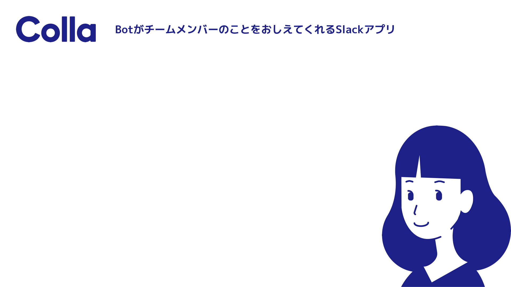

# **コロナ時代を生き抜く(?) ひとつ上の  Slack "コラ"ボレーション**

---

# 自己紹介

::::: grid1-2
:::: grid-item center circle-image

::: classes small
 [@munky69rock](https://twitter.com/munky69rock)
:::
::::
:::: grid-item
**上原 将之**
株式会社トラックレコード CTO

::: classes small
前職は DeNA で小説投稿サイトの[エブリスタ](https://estar.jp/)とか 遺伝子検査の[MYCODE](https://mycode.jp/)とか[AI 創薬プロジェクト](https://healthcare.dena.com/projects/services/aidrugdiscovery/)などなどやってました
:::
::::
:::::

---

## [株式会社トラックレコード](https://www.trackrecords.co.jp/)って？

以下のようなサービスを開発・運営してます

**エンジニアキャリア支援サービス**

- 「[kiitok（キイトク）](https://www.kiitok.com/)」
  - ネクストキャリアを考えている人は是非ご相談を、エンジニアの採用市況はかなり詳しいです:muscle: \[PR]

**チームのエンゲージメントを向上させる Slack アプリの開発**

- Bot が社員インタビューをしてメンバー紹介してくれる「[Colla（コラ）](https://atengagement.com/slackapp/colla/)」
- 仲間をスタンプでホメて、表彰する「[ホメルくん](https://homerukun.slackapp.studio/)」
- 仲間をコメントで褒めて表彰する「[ノビルくん](https://nobirukun.slackapp.studio/)」

---

# Agenda

1. チームコミュニケーションを活性化させる Slack アプリ 「Colla（コラ）」のご紹介
2. いますぐ使える Slack ノウハウ

---

# チームコミュニケーションを活性化させる  Slack アプリ「Colla（コラ）」のご紹介

---

<!--
header: "チームコミュニケーションを活性化させる Slack アプリ「Colla（コラ）」のご紹介"
-->

# Colla（コラ）

::::: grid2-1
:::: grid-item
::: classes small

Bot が社員インタビューをしてメンバー紹介してくれる無料 Slack アプリ

**課題**

- コロナ禍でリモート前提の働き方にシフト
- チャットベースだとコミュニケーション減りがち (雑談など)
- 新メンバーのオンボーディングもなかなか対面で顔を合わせることができない...

**Colla（コラ）が解決してくれること**

- コラさんが勝手にメンバーに質問、毎日回答を発表
  - 雑談のきっかけ、あまり関わらなくなったメンバーのことが知れる
- 新メンバーが Slack に join したタイミングで質問、回答するとみんなに紹介してくれる
  - リモートでのオンボーディングをよりスムーズに

:::
::::
:::: grid-item center

::::
:::::

---

# Colla（コラ） 誕生ストーリー

- コロナの猛威、緊急事態宣言、ステイホーム、、、
- ピンチはチャンス、今のタイミングで会社としてできるとは？
  → 緊急事態宣言終了する前に新しいチャレンジを世に出したい！
- GW 一週間くらいでガッと企画・開発 → リリース :rocket:

---

- リリース直後に日経新聞・めざまし土曜日などで取り上げられる :eyes:
- 現在多くの WS でインストール、問い合わせも多数 :chart_with_upwards_trend:
- Twitter などでも好意的なコメント:pray:

#### <!-- fit --> 参考 - [新型コロナ:テレワーク社員にアプリが質問 雑談共有で人柄理解 :日本経済新聞](https://www.nikkei.com/article/DGXMZO59689850Y0A520C2L83000/) - [Kyash Office Report Vol.1/ Slack bot の Colla の導入とその後｜ Kyash People Team ｜ note](https://note.com/kyashrecruit_jp/n/n85375e69ef41) - [Colla ユーザーのみなさまの声](https://colla.guide/Colla-95ba024f198148778485ec84f327e2a0)

---

# Colla の機能のご紹介

---

# Colla の機能のご紹介

1. メンバーインタビュー & 回答の発表
2. 新メンバーのオンボーディングサポート
3. :new: Web でのメンバープロフィール機能

---

# Colla の機能のご紹介

1. **メンバーインタビュー & 回答の発表**
2. 新メンバーのオンボーディングサポート
3. :new: Web でのメンバープロフィール機能

---

## 1. メンバーインタビュー & 回答の発表

一日一回、特定の時間にメンバーに質問、特定のチャンネルで回答を発表

:::: grid2

::: grid-item

:::

::: grid-item

:::

::::

---

## 1. メンバーインタビュー & 回答の発表

- **対象メンバー**は WS 全体と指定チャンネル限定の 2 パターンで設定可能
  - 現在ゲストアカウントは対象外になっています :bow:
- **質問を投げる時間、人数、回答を発表する時間、チャンネル、人数**はカスタマイズ可能
- 質問自体のカスタマイズは今後対応検討

---

## WS 全体 or チャンネル限定？

**チャンネル限定の場合**

ユースケース

- とりあえずテスト的に始めてみたい場合
- 大きめの組織、チームに絞って利用したい

**:warning: 注意 :warning:**

- 現状、1WS で 1 つしか利用できない
  → 複数チームでコンフリクトすることも... :bow:
- 設定を一部の管理者に絞る管理機能は直近リリース予定
- 複数チャンネル対応も今後対応していく予定です

---

## WS 全体 or チャンネル限定？

**WS 全体の場合**

ユースケース

- 小さめの組織、最近知らないメンバーが増えてきた...
- 組織全体でコミュニケーション活性化したい

**:warning: 注意 :warning:**

- 事前の予告なしにいきなり WS 全体適応すると Colla さんから DM 飛んできてネガティブな人も一定数いる
- 現状個人での off 設定はできないが、 bot 自体の mute 設定は可能なので事前にシェアしておくとスムーズ
- いずれは機能化したい 🤔

---

# Colla の機能のご紹介

1. メンバーインタビュー & 回答の発表
2. **新メンバーのオンボーディングサポート**
3. :new: Web でのメンバープロフィール機能

---

## 2. 新メンバーのオンボーディングサポート

新メンバーが join したときに、その人の人となりがわかるような質問とその発表で
メンバーの理解促進やコミュニケーションのきっかけに :relaxed:

::: grid2

:::

---

## 2. 新メンバーのオンボーディングサポート

対象メンバー設定の違いで挙動に違いがあります

**チャンネル限定の場合**

- 設定されたチャンネルに新メンバーが join したタイミングで質問

**WS 全体の場合**

- Slack の WS に新メンバーが join したタイミングで質問

---

## 2. 新メンバーのオンボーディングサポート

### チャンネル限定の場合の注意

- チャンネル限定版の機能追加をリリース後に行った関係で、新たに権限取得が必要に (bot を指定 channel に invite する権限)
- 11/12 以前にインストールしていた場合は再度インストールが必要 :bow:
  - アンインストールなどする必要はなく、 [colla.jp/install](https://colla.jp/install) からインストールし直していただければ大丈夫です :ok_woman:
- ちなみにアップデートしない場合は WS 全体と同じ挙動になります

---

# Colla の機能のご紹介

1. メンバーインタビュー & 回答の発表
2. 新メンバーのオンボーディングサポート
3. **:new: Web でのメンバープロフィール機能**

---

## 3. Web でのメンバープロフィール機能

できること

- Web 上でメンバーの一覧や質問の回答を見れる
- 過去に回答した質問の編集ができる
- プロフィールの入力と閲覧ができる

::: grid2

:::

---

## 3. Web でのメンバープロフィール機能

**ユースケース**

- 簡易的な社員名簿として
  -  社員名簿にありがちな、一度書いたらあまりメンテされない問題
  - 質問の回答を通して比較的鮮度の高い情報がアップデートされていきやすい
- 新しく入社したメンバーが、社内の人のことを早く知りたいとき
- 社内の気になるあの人について、ちょっと知りたいとき
- 仲間の隠れた才能を発見したいとき
- 初めて MTG する人の人となりを知りたいとき

など

---

# 開発中機能チラ見せ

---

## 開発中機能チラ見せ

**盛り上がりスレッド検知機能**

:::: grid2
::: grid-item

- 社内でテスト運用中、評判よい
- 権限追加してメッセージ取れるようになるので出し方を検討中...
- ちなみに  `message` イベントの `subtype=message_replied` なものからスレッドの親メッセージの `reply_count` を取るだけで簡単に実装できるので自前で作ってみるのもオススメ
  :::
  ::: grid-item
  
  :::
  ::::

---

## 開発中機能チラ見せ

**Candy 機能 (仮)**

:::: grid2
::: grid-item

- メンバーの Good アクションなどに対して :candy: を贈れる機能
- 詳細はまだまだ秘密です :secret:

:::
::: grid-item

:::
::::

---

# Colla の始め方

1. [Slack App Directory](https://slack.com/apps/A012X57B3N1-colla) または [colla.jp/install](https://colla.jp/install) からアプリをインストール
2. Web 上で初期設定
   - 対象メンバー、通知チャンネルの 2 つだけ
3. 早速利用スタート :tada:

  

::: classes center
**10 秒で利用開始できます :ramen:**
:::

---

::: classes center
まだ利用されてない方いればこの場で是非 :innocent:
:::

---

## Colla の情報ソース

**Twitter**

- [twitter.com/atengagement](https://twitter.com/atengagement)

**オフィシャルガイド**

- https://colla.guide

---

## フィードバックはこちらまで

スラッシュコマンドから

- `/colla feedback`
  - こちらは現状返信ができないのでご容赦ください :bow:

Web から

- [colla.jp/contact](https://colla.jp/contact)

  

::: classes center
**:pray: まだまだこれからのプロダクトなので是非皆さんのご意見をください :pray:**
:::

---

<!--
header: ""
-->

# いますぐ使える Slack ノウハウ

---

<!--
header: "**いますぐ使える Slack ノウハウ**"
-->

## メニュー

1. 上原個人が意識してること
2. トラックレコード社での取り組み事例
3. メンバーに聞いてきました

---

# 上原個人が意識してること

---

Slack のこの機能がないと困る？

* 絵文字, スレッド, etc...
* → 個人的には圧倒的に**リマインド機能**

---

## やりがちなミス

- モバイルで Slack のメッセージを確認、あとで PC から返信しようと思って忘れる...
- 一度に複数のトピックについて Slack で話しかけられ、一部の返信忘れる...

などなど

  

→ リモートワークで Slack コミュニケーション増えてくると結構ハマりがち

---

アクション必要だがすぐに対応できないものはすべてリマインドを設定する

- Slackbot チャンネルで簡易的な ToDo リストとしても利用できるので漏れにくい (Mark as Complete)

::: grid2

:::

---

ただし...

- これだけだとリマインドしたものを既読にしてしまったまま忘れることがある :innocent:

  - Slackbot チャンネルにリマインド仕込むなりして定期的に整理する癖つけておくと多少安心だが...

    - 例: Slackbot チャンネルで次を実行
      `/remind here "タスク定期確認" at 9:00 every weekday`

  → 普通に完了してないものがあるときだけ呼んでほしい、未完了タスク一覧すべてがパッとわかるかというと微妙 (ノイズが多く流れてしまう)

- いい感じの Slack アプリ作って解決したい...
  - ~~年末年始の上原にご期待ください~~
  - もしくは良いソリューションあれば教えて下さい :pray:

---

# トラックレコード社での取り組み

---

各社いろいろな bot を作成して業務効率改善などされてると思いますが
弊社で動いてる bot もいくつかご紹介します
(コードもあるよ)

---

:information_source: **一応参考までに**

弊社の組織規模

- 正社員 3 名
- 副業メンバー 10 数名

という小規模組織です

---

# times-all bot

---

# times-all bot

いわゆる `times` チャンネルのメッセージを一箇所にまとめて通知してくれる bot

---

# times-all bot

### 背景

- もともと `times` チャンネルはあったがそこまで活用されてなかった
  - 週一誰かが一言つぶやくかどうかのレベル
- times チャンネル作るだけだと新規で入ってきたメンバーはそのチャンネルの存在に気づかない
- とはいえデフォルトで invite するかというと Too Much 感...
- 結果やはりあまり使われない
- 副業メンバー増えてくる中で、アクティビティあげるためになにかできない？

---

# times-all bot

### 導入してみた結果

- シンプルにメッセージ量が増えた
  - 毎日誰かがなにかつぶやいてる
  - 業務報告的なものはもちろん、雑談的なものも
- 上記に伴い、誰がいつどこでなにをしてるかわかりやすくなったので透明性が上がった
- メンバーの個人的な趣味など発見が増えた
  - Colla といい感じの補完関係になってる

---

# Notion unfurl bot

---

# Notion unfurl bot

Slack に貼り付けた Private な notion のリンクの中身を展開する bot

---

# Notion unfurl bot

### 背景

- 弊社は Wiki ツールとして Notion を利用
- ドキュメントをまとめてリンクとして共有しても、中身がぱっとわからないといちいちクリックするのが面倒なのであとにしようと思ったまま読まない事も多い
- 結果、情報共有漏れなどが発生してしまう

---

# Notion unfurl bot

### 導入してみた結果

- いちいち URL 開かなくても概要が把握できるのでシンプルに楽
- リンクの視認性が上がるのであとから見返したときに見つけやすい

---

# Notion unfurl bot

### 備考: Slack app unfurling について

- Slack のメッセージにリンクが含まれている場合、 `link_shared` イベントが発生
- `link_shared` イベントに対して `chat.unfurl` API を利用することで、リンクの展開に独自の機能を追加できる

→ 公式で Slack アプリがないようなツールなどで bot 作成するのに便利

::: classes small
参考: [Unfurling links in messages | Slack](https://api.slack.com/reference/messaging/link-unfurling#response)
:::

---

**コードはこちら**

- https://github.com/trackrecords/slack-times-all-app
- https://github.com/trackrecords/slack-notion-unfurl-app

いずれも TypeScript + Bolt for JavaScript を利用したもの
イベントに合わせて多少いじったのでバグっていたら PR などください:bow:

---

# メンバーからきいてきました

---

# メンバーからきいてきました

今をときめく有名企業で働く副業メンバーたちに聞いてみました :ear:

---

## マルチバイト絵文字でワンランク上の体験

問題

- 検索性などからアルファベットオンリーで絵文字を登録してる WS も多いハズ
- ただ、通知などでアルファベットで表示されると視認性が微妙... (`:pattomiwakaran:`)
- とはいえ日本語で登録すると検索がめんどくさい...

Tips

- 絵文字登録時はマルチバイト文字で登録
  - `ぱっとみわからん`
- エイリアスでアルファベットバージョンも登録
  - `pattomiwakaran`

→ こうすることで、視認性と検索性両方を担保した快適な絵文字ライフに :tada:

---

## テンポラリーチャンネル

- 何か対象者に作業を促したい時（年末調整とか）は、対象者を一時的な channel に対象者を集めて、終わったら leave するように案内。
- 作業が終わっていない人には `@channel` でリマインドできるので管理や運用がシンプルに :tada:

---

## reacji-channeler でインシデント管理の一元化

[Reacji Channeler](https://slack.com/apps/A1BFDR28J-reacji-channeler)

- Slack 公式の Slack アプリ (公式の割に意外と知らない人が多い)
- 絵文字とチャンネルのセットを設定しておくと、設定した絵文字がついた場合に、設定したチャンネルに転送してくれるもの

シンプルさ故にいろいろなユースケースはあるが、
例えばインシデントの報告が様々なチャンネルから上がって来るような場合、
当該スレッドを見つけた人が専用の emoji をつけるとそのスレッドのリンクが専用の channel に流れるので、
その channel さえウォッチしてれば当該のスレを見に行ける、といったことも可能

---

# まとめ

- コロナ禍のチームコミュニケーションは Colla がおすすめ
  是非使ってみてフィードバックください!
- Slack を活用してコロナに負けない強いチームに :tada:

---

# We are hiring!!

業務委託・副業でお手伝いいただける方は Welcome です:exclamation:
お気軽に[DM](https://twitter.com/messages/compose?recipient_id=49951192)などでご連絡ください :relaxed:

::: classes small
参考: [bosyu](https://bosyu.me/b/czjTC9BRIJs)
:::

---

# Colla の技術スタック

::: spread

- Node.js
  - TypeScript
  - [Bolt for JavaScript](https://github.com/slackapi/bolt-js)
  - [Nest.js](https://nestjs.com/) (not Next.js or Nuxt.js)
  - [TypeORM](https://typeorm.io/)
  - [Bull](https://github.com/OptimalBits/bull)
- Google App Engine (Standard)
- PostgreSQL
- Redis
- Docker
- GitHub Actions
- Sentry

---

::: classes center
END
:::
